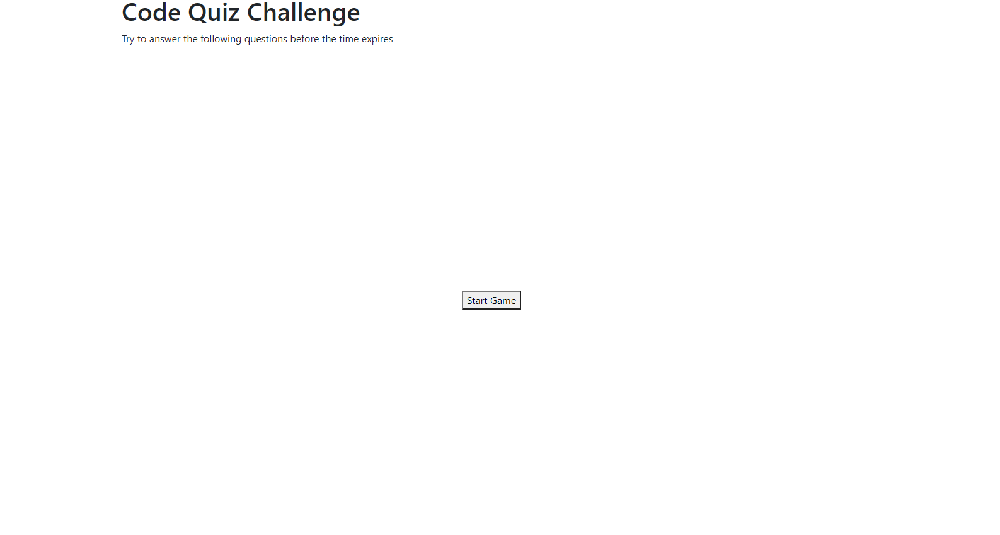
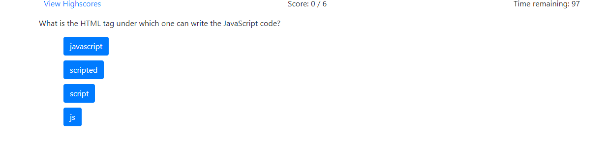
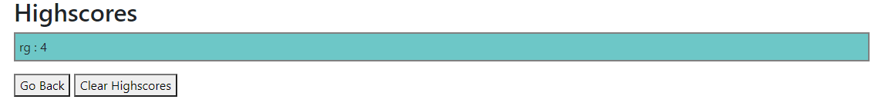
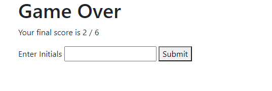

# Code_Quiz-Robert_Greenawalt

This project is a quiz game featuring Javascript based questions. The game starts with a start screen and the user can click to initialize the game. The timer begins to count down from 100 seconds and the user will select an answer; if they answer incorrectly 10 seconds are subtracted from the timer. If the user completes all six questions or the timer reaches 0, the game is over and the user is redirected to the game over screen. 

Next the user may submit their initials and record their score, and the score is then displayed to the user; the score is saved in local storage. If the user would like to go back, they can click on the go back button which will redirect them to the start screen, and the game may be played over again continuously. 

https://rsg71.github.io/Code_Quiz-Robert_Greenawalt/